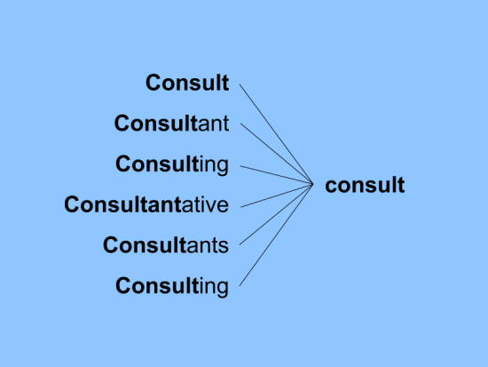
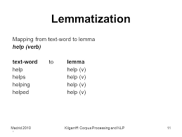

# designated_winner

Stemming and Lemmatization are two of the most prominent techniques for text processing in Machine Learning / Natural Language Processing.
This model evaluates stemming features' vs lemmatizing features' performance when used for large scale applications. The model
used here is a simple Neural Network for Sentiment Analysis.

# Stemming

- In linguistic morphology and information retrieval, stemming is the process of reducing inflected (or sometimes derived) words to their word stem, base or root form—generally a written word form. (from Wikipedia)

# Lemmatization

- Lemmatisation (or lemmatization) in linguistics is the process of grouping together the inflected forms of a word so they can be analysed as a single item, identified by the word's lemma, or dictionary form. (from Wikipedia)

## Demo : (from scratch)

- download/clone the repository
- run 'sentiment featureset creation.py'
- it should generate 2 pickle files. USE these as input for your neural network and build

## Demo : (using pickle files directly)

- download/clone the repository
- run both the neural networks

### Built and maintained with *Python 2.7*
# Author - Aamir Syed
